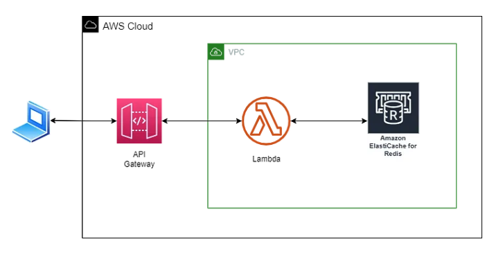

### Lambda - ElasticCache

How to use Lambda with ElasticCache in serverless framework!



> Example CURL

```bash
curl -X POST \
  https://doyi4k7vm8.execute-api.us-east-1.amazonaws.com/write-cache \
  -H 'Content-Type: application/json'
```

> Tutorial - `https://awstip.com/integrating-aws-elasticache-redis-with-aws-lambda-using-serverless-framework-and-cloudformation-e41a88cef604`